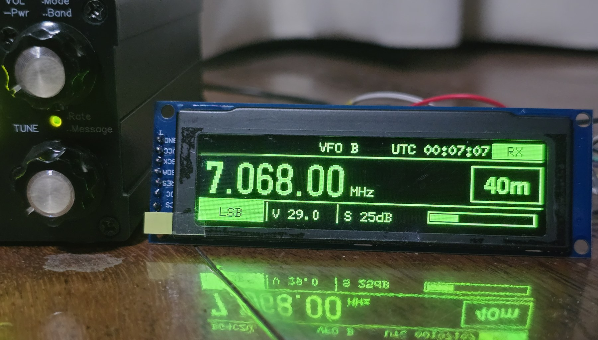

# QMX+ ESP32-S3 SSD1322 OLED Display

An external 3.12-inch 256x64 SSD1322 OLED display for the QRP Labs QMX/QMX+.
The ESP32-S3 reads the QMX AUX CAT interface, shows radio status in real time,
and uses Wi-Fi for UTC synchronization and hourly propagation indicators.

This build was developed and tested with a QMX+ and a 7-pin SPI SSD1322
module.



## Features

- Frequency, band, mode, active VFO, RIT and split status
- RX S-meter, AF volume, RF gain and AGC attenuation
- TX power/SSB PEP, SWR and SWR protection warning
- Large two-line QMX CW decoder view with fast text polling
- UTC time from NTP, displayed locally without writing the QMX RTC
- Current-band `GOOD` / `FAIR` / `POOR` hint using hourly HAMQSL SFI and K-index
- Captive Wi-Fi setup page; home Wi-Fi credentials are stored only in ESP32 NVS
- Automatic AUX UART RX/TX pin-orientation scan
- Separate passive cable-continuity and AUX-voltage diagnostic sketches

The propagation label is a simple index-based operating hint, not a
point-to-point prediction.

## Hardware

- ESP32-S3 development board
- 3.12-inch 256x64 SSD1322 SPI OLED, 7-pin version
- QRP Labs QMX or QMX+
- 3.5 mm TRS cable for the QMX AUX connector
- Common ground between the QMX and ESP32-S3

## Wiring

### SSD1322 OLED to ESP32-S3

| OLED pin | Signal | ESP32-S3 |
|---:|---|---:|
| 1 | GND | GND |
| 2 | VCC | 3V3 |
| 3 | SCK | GPIO12 |
| 4 | SDA / MOSI | GPIO11 |
| 5 | RES | GPIO13 |
| 6 | DC | GPIO9 |
| 7 | CS | GPIO10 |

The display is write-only SPI; no MISO connection is required.

### QMX AUX TRS to ESP32-S3

| TRS contact | QMX signal | Tested cable color | ESP32-S3 |
|---|---|---|---:|
| Tip | QMX TX | Red | GPIO18 (ESP RX) |
| Ring | QMX RX | White | GPIO17 (ESP TX) |
| Sleeve | Ground | Black | GND |

Cable colors are not standardized. Verify Tip, Ring and Sleeve with a
multimeter before connecting the radio. UART signals cross: QMX TX goes to ESP
RX, and QMX RX goes to ESP TX.

## QMX configuration

Configure the QMX AUX serial interface for:

- Serial 1 on AUX: enabled
- Baud rate: 9600
- 8 data bits, no parity, 1 stop bit

The main firmware initially tries both GPIO17/GPIO18 UART orientations and
keeps the orientation that returns valid CAT replies.

## Firmware layout

```text
firmware/
  qmx_oled_display/
    qmx_oled_display.ino
  diagnostics/
    aux_probe/
      aux_probe.ino
    cable_continuity/
      cable_continuity.ino
```

Use `qmx_oled_display.ino` for normal operation. The diagnostic sketches are
temporary troubleshooting firmware and replace the main firmware when flashed.

## Build and upload

Arduino IDE requirements:

1. Install the Espressif ESP32 board package.
2. Install the `U8g2` library.
3. Select an ESP32-S3 board profile.
4. Open `firmware/qmx_oled_display/qmx_oled_display.ino`.
5. Compile and upload over the ESP32 USB serial port.

Equivalent Arduino CLI commands:

```powershell
arduino-cli compile --fqbn esp32:esp32:esp32s3 firmware/qmx_oled_display
arduino-cli upload -p COM5 --fqbn esp32:esp32:esp32s3 firmware/qmx_oled_display
```

Replace `COM5` with the USB serial port assigned to your board. Do not select a
Bluetooth virtual COM port.

## Personalization

Near the top of the main sketch, change these constants if required:

```cpp
constexpr char DISPLAY_TITLE[] = "QMX+";
constexpr char SETUP_AP_SSID[] = "QMX_UTC";
constexpr char SETUP_AP_PASSWORD[] = "qmxutc88";
```

Change the setup password before giving programmed hardware to another person.

## Wi-Fi setup and UTC

For five minutes after startup, the ESP32 provides the setup network:

- SSID: `QMX_UTC`
- Default password: `qmxutc88`
- Setup address: `http://192.168.77.1`

Enter a 2.4 GHz-capable Wi-Fi SSID and password. A combined 2.4/5 GHz SSID is
normally compatible. After connection, the display changes from `UTC WIFI...`
to `UTC NTP...`, then to `UTC HH:MM:SS`.

The setup form stores credentials in ESP32 NVS. No home-network SSID or password
is embedded in this repository.

The AUX connection is deliberately read-only. NTP updates the OLED clock only;
the firmware never sends a `TMhhmmss;` clock-set command to the QMX. This avoids
competing with FT8 applications that control the radio over USB CAT.

## Propagation data

The firmware reads the public HAMQSL solar XML feed no more than once per hour,
as requested by the feed provider. It displays the current SFI and K-index and
derives a compact current-band hint. Data retrieval runs in a background task
so CAT polling and CW decoding remain responsive.

The current implementation uses TLS without certificate validation for this
public, non-sensitive feed. Do not reuse that pattern for credentials or other
sensitive data.

## Safety

- Power the OLED from 3.3 V unless your exact module documentation says
  otherwise.
- Confirm AUX wiring and voltage levels before connecting the ESP32.
- Keep QMX TX and ESP RX crossed, and share ground.
- Test receive-only behavior before transmitting.
- Use a tuned antenna and keep QMX SWR protection enabled.
- This project displays and polls radio state; the operator remains responsible
  for safe and lawful operation.

## Data source and acknowledgements

- QRP Labs QMX/QMX+ CAT protocol and transceiver documentation
- U8g2 display library
- HAMQSL/N0NBH solar-terrestrial XML data
